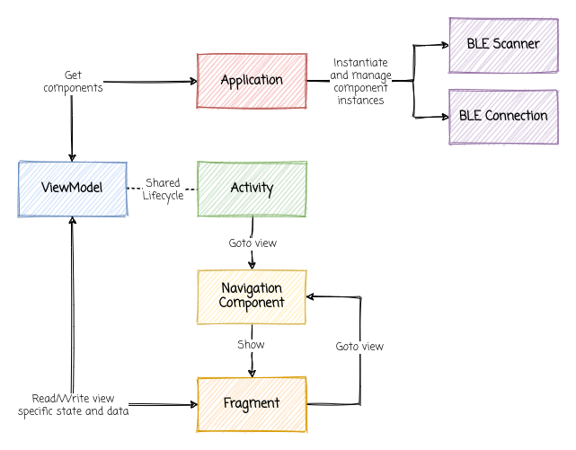

# Android application demo
This is a very simple example app demonstrating a modular application architecture design. To give it a realistic context, a BLE reader feature is implemented. It's built tightly around the MVVM design paradigm and relies heavily on the `ViewModel` and `LiveData` components.

## Coarse grained structure

As a step towards separating concerns, the app is divided into three Gradle modules: _core_, _app_ and _design_, all responsible for select parts of the implementation. This also allows for a structured way of working where toe-stepping is kept to a minimum.

### Core

The core module holds the "business logic". In this particular case it means the concrete BLE device scanning and connection implementations and the corresponding domain objects. Most of the unit tests would also be found in this module, but nothing related to UI or design.

### App

The app module holds the "view logic". This is all the logic that makes the view behave the way it does, like Activities, Fragments, list adapters and ViewModels. Text and graphical resources (icons and images), as well as UI and instrumentation test cases would live here, but no global style definitions.

### Design

The design module holds all the global style and theme definitions as well as global animations that apply to all view components of a certain type. Custom view components could also be put here if the intention is to share them in the entire app.

## Application structure

### Components (BLE Scanner etc)

These objects expose a particular feature realm, not limited to any particular view or use case. The scanning of BLE devices is one example. The interaction with a BLE device is another. These components implement a classic interface approach, keeping our mocking options wide open during testing (where relevant).

### Application

The Application object acts as a component repository. This object knows how to instantiate and serve components used through out the app. This aspect of the Application object is implemented in the _core_ module (which is then extended in the _app_ module).

### ViewModel

These objects are responsible for reflecting a set of features, a use case if you so will, for a particular view. They do so by using one or more components obtained from the (core) Application implementation. Since the view model doesn't know how to instantiate these components, but rather requests them from the injected Application, it can be unit tested quite easily.

### Activity

The Activity is the root lifecycle component for a given view (but it's not the view itself). It's responsible for showing the global view state. In this app we differentiate between, say, a "Bluetooth disabled" view and the "Devices details" view. The latter you can navigate to, while the former can occur at any time during the application lifetime, and rather than sharing the knowledge of how to handle the disconnected Bluetooth state to all Fragments, it's collected in the parent Activity.

### Fragment

The Fragment is responsible for the view components related to a given use case. It can use one or many view models for this.

### Navigation Component

This is a Android system component that is responsible for managing the view transition states. It know of the view tree and defines the possible navigation paths from one view to the other.

